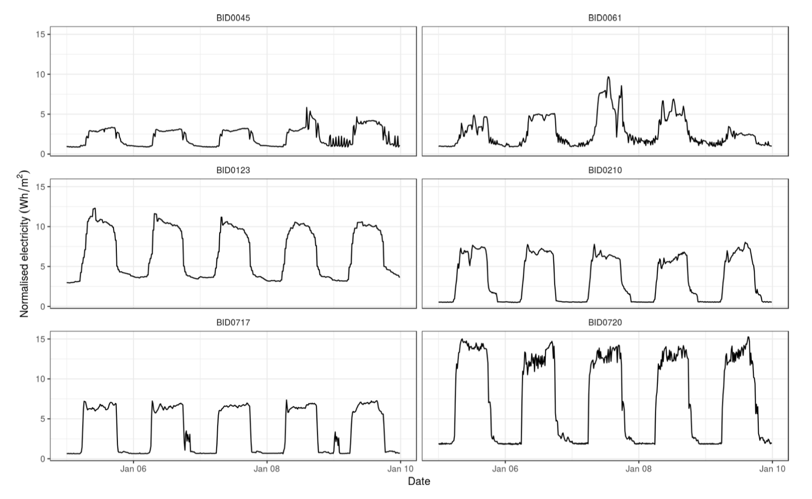
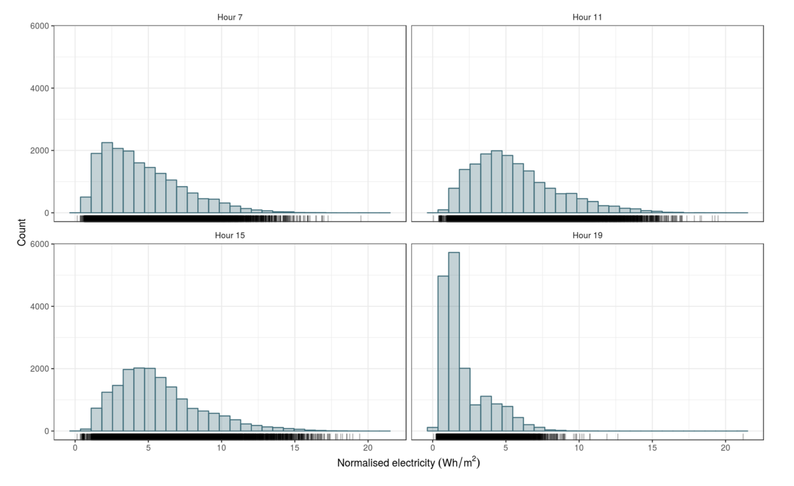
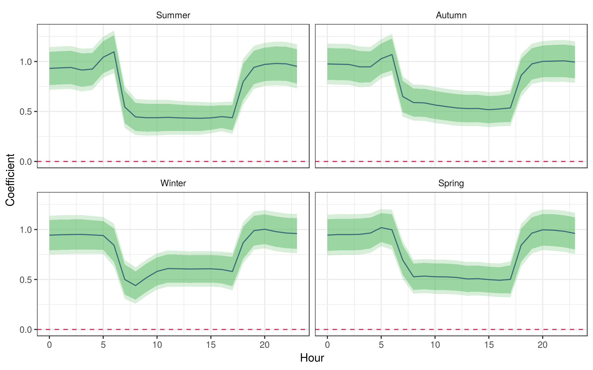
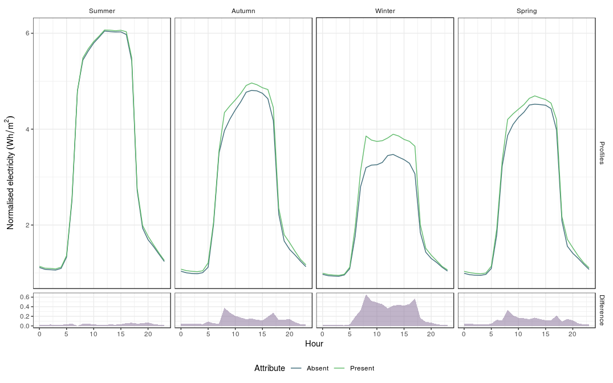
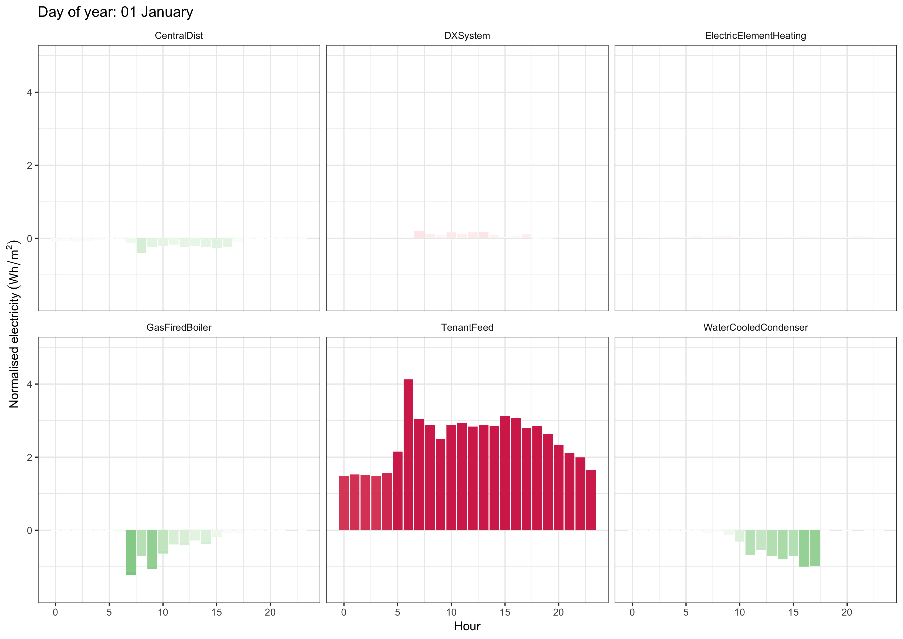

```{r setup, include=FALSE}
knitr::opts_chunk$set(
	echo = FALSE,
	fig.align = "center",
	message = FALSE,
	warning = FALSE,
	dev = "png",
	dpi = 150
)
# fig.width = 10,
	# fig.width = 6


# run this manually to generate R package citations
#knitr::write_bib(c("base", "caret", "xgboost"), "./gefcom-2017/packages.bib", width = 60)

rm(list=ls())

library(tidyverse)
library(readxl)
library(lubridate)
library(scales)

set.seed(12345)

gefcom_dir <- "./../../../papers/gefcom-2017/cache/" # knitr

#load(file.path(cache_dir, "results.RData"))
```

# Exploring building characteristics

## Motivation

We want to understand which building characteristics influence energy demand and quantify the expected energy consumption.

Work with smart meter and characteristic data for 129 commercial buildings across Australia.

3 years 15-minute meter data available.

## Smart meter data

```{r meter-data, out.width="100%"}

```

-----------

```{r skew-plot, fig.cap="Histogram of normalised energy for all commercial buildings.", out.width="100%"}

```


## Building characteristics

Worked with engineers to identify which characteristics are suspected to be most important factors in energy consumption.

```{r}
read_csv("data/attributes.csv") %>% 
  knitr::kable() %>% 
  kableExtra::kable_styling()
```

## Outlier detection

```{r outlier-plot, fig.cap="Hourly boxplots of normalised energy demand for building BID0107.", out.width="100%"}
knitr::include_graphics("fig/outliers.png")
```

## Linear mixed model

Working with strongly correlated data within buildings. Use linear mixed model with buildings treated as random effects and characteristics as fixed effects. A random slope based off year used to capture any trends in building consumption.

For a particular season and hour of the day, the demand $y_{ij}$ for building $j$ and observation $i \in \left\{ 1, 2, \ldots n_j\right\}$ is

$$
\log y_{ij} = \beta_0 + \sum_{h=1}^p \beta_h x_{hij} + u_{0j} + u_{1j} t_{ij} + \epsilon_{ij}, \\
\begin{bmatrix} 
  u_{0j} \\ 
  u_{1j}
\end{bmatrix} \sim N(0, \Omega_u), \quad
\Omega_u = \begin{bmatrix}
              \sigma^2_{u0} & \sigma_{u01} \\
              \sigma_{u01} & \sigma^2_{u1}
            \end{bmatrix}, \\
\epsilon_{ij} \sim N(0, \sigma^2_\epsilon),
$$

where $\beta_h$ is the coefficient for predictor $x_{hij}$, $u_{0j}$ is the random intercept for building $j$, $u_{1j}$ is the random slope coefficient for year $t_{ij}$ and $\epsilon_{ij}$ are the residuals.


------------

### Estimating energy profiles

We use the estimator proposed by @Kennedy1981-xu to calculate the proportional impact, $p_h$ of $X_{hij}$ on the dependent variable $Y_{ij}$. Kennedy's estimator is consistent and almost unbiased [@Giles2011-cv]. For a dummy variable changing from zero to one the estimator is given by

$$
\hat{p}_h = e^{ \hat{ \bar{\beta}}_h - 0.5 \widehat{ \text{ase}}\left( \hat{ \bar{\beta}}_h \right)^2} - 1.
$$

As this is the proportional impact we can rewrite the above expression in terms of our response variable to obtain

$$
Y_{ij}^* = e^{ \hat{ \bar{\beta}}_h - 0.5 \widehat{ \text{ase}}\left( \hat{ \bar{\beta}}_h \right)^2} \mathbb{E} \left[ Y_{ij} | X_{hij} =  0 \right],
$$

where $Y_{ij}^*$ is the new demand value after our Boolean variable has changed from false to true.


## Model selection

For our model selection we use the marginal AIC (mAIC) which is the most widely used information criteria for mixed effects models. @Vaida2005-mt define the mAIC as

$$
mAIC = -2\ell\left(\hat{\mathbf{\beta}}\right) + 2 (p+q),
$$

where $\ell\left(\hat{\mathbf{\beta}}\right)$ is our log-likelihood function, $p$ is the number of fixed effects, $q$ is the number of random effects. We choose this criterion as it is both simple to understand and has been used in many studies [@Muller2013-pc].


## Multimodel inference

Unfortunately there was no clear best model using $mAIC$. Our problem can be approached using multimodel inference.

### Candidate sets

To construct our candidate set we must first determine the probability of each candidate model. To do so we use Akaike weights. Given $R$ candidate models the Akaike weight for model $g_i$ is:

$$
w_i = \frac{\mathcal{L} \left(g_i | \mathbf{x} \right)}{\sum_{r=1}^R \mathcal{L} \left(g_r | \mathbf{x} \right)} 
    = \frac{e^{-\frac{1}{2}\Delta_i}}{\sum_{r=1}^R e^{-\frac{1}{2}\Delta_r}},
$$

where $\mathcal{L} \left(g_i | \mathbf{x} \right)$ is the likelihood of model $g_i$ given data $\mathbf{x}$ and $\Delta_i = mAIC_i - mAIC_{min}$ and is referred to as the AIC difference. We use $mAIC$ in our analysis as we are dealing with mixed effects models. Other information criteria for mixed effects models such as the conditional AIC [@Greven2010-sv; @Vaida2005-mt] may also be used.

-------------

### Parameter estimates

Parameters are estimated by "averaging" the models in our confidence set. There are two common approaches:

* _Natural-model averaging_ averages over all candidate models where a parameter of interest occurs.
* _Full-model averaging_ considers all candidate models. If a variable is not selected in one of the candidate models, full-model averaging sets its estimate to zero.

Simulation studies have found that full-model averaging can help to reduce problems caused by model selection bias towards over-complex models [@Lukacs2010-xz].

-----------

Given a candidate set of $R$ models our coefficients $\beta_h$ are estimated by full model averaging:

$$
\hat{\bar{\beta_h}} = \sum^R_{i=1} w_i \hat{\beta}_{hi},
$$

where $\hat{\beta}_{hi}$ is the estimate of $\beta_h$ based on model $g_i$. If $\beta_h$ is not chosen in model $g_i$ then $\hat{\beta}_{hi}$ is defined to equal zero in the above formula.

-------------

### Unconditional confidence intervals

Once a set of candidate models has been identified we can construct confidence intervals that reflect both parameter and model selection uncertainty. The $\left( 1-\alpha \right)100\%$ unconditional confidence intervals for the a model averaged coefficient $\hat{ \bar{ \beta}}_h$ is given by

$$
\hat{ \bar{ \beta}}_h \pm z_{1- \alpha/2} \widehat{ \text{ase}}\left( \hat{ \bar{\beta}}_h \right),
$$

where $\widehat{ \text{ase}}\left( \hat{ \bar{\beta}}_h \right)$ is the adjusted standard error from @Burnham2002-vs. It is given by

$$
\widehat{ \text{ase}}\left( \hat{ \bar{\beta}}_h \right) = \sum^R_{i=1} w_i \sqrt{ \left( \frac{t_{\text{df}_i, 1-\alpha/2}}{z_{1-\alpha/2}} \right)^2  \widehat{\text{var}} \left( \hat{\beta}_{hi} | g_i \right)  
  + \left( \hat{\beta}_{hi} - \hat{\bar{\beta}}_h \right)^2 },
$$

where $\bar{\beta}_h$ is the model averaged estimator of $\beta_h$, $\widehat{\text{var}} \left( \hat{\beta}_{hi} | g_i \right)$ is the estimated variance of parameter $\beta_{hi}$ in model $g_i$, and $w_i$ are weights. The calculation of $\widehat{\text{var}} \left( \hat{\beta}_{hi} | g_i \right)$ for mixed effects models is reasonably complex and is omitted (see @Bates2015-zw for a discussion).


## Results

```{r coefficients, fig.cap="The solid line shows the estimated tenant feed coefficients for each hourly model. 80\\% and 90\\% confidence intervals are indicated by the shaded ribbons.", out.width="90%"}

```

----------

```{r mmmme-profile, fig.cap="Profile plots of electric element heating impact. As expected the heating demand mainly plays a role in winter.", out.width="90%"}

```

---------

```{r profile-animation, out.width="100%"}

```


## Further research

Including more buildings will allow for more confident conclusions to be reached and more characteristics to be investigated.

* Apply to the residential sector to estimate the impact of demand influences such as solar generation, batteries or other household items.
* Assess the impact of policies on energy consumption.


# Questions?

## References {-}