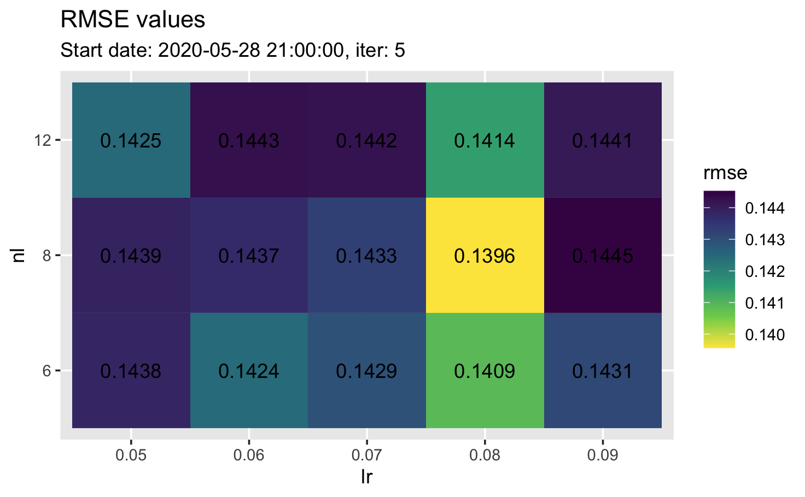

```{r setup, include=FALSE}
knitr::opts_chunk$set(
	echo = FALSE,
	message = FALSE,
	warning = FALSE,
	cache = TRUE
)
library(tidyverse)
library(podEnergyComp)
library(lubridate)

fcst_start_date <- ymd("2020-07-03")

# predict PV and demand
demand.data <- load_demand_data()
demand.cv <- cv_ts_folds(demand.data$datetime,
                         start_date = fcst_start_date,
                         horizon = 7, 
                         iterations = 1)
demand.forecast <- pred_demand(
  select(demand.data, -datetime),
  demand.cv[[1]]$train,
  demand.cv[[1]]$test,
  nrounds = 500L,
  num_leaves = 10L,
  learning_rate = 0.1,
  obj = "regression",
  metric = "regression"
)

pv.data <- load_pv_data()
pv.cv <- cv_ts_folds(pv.data$datetime, 
                     start_date = fcst_start_date,
                     horizon = 7, 
                     iterations = 1)
pv.forecast <- pred_pv_quantile(
  pv.data,
  pv.cv[[1]]$train,
  pv.cv[[1]]$test,
  alpha = 0.5, # High PV generation so don't need to fit all quantiles
  num_iterations = 250L,
  num_leaves = 31L,
  learning_rate = 0.03
)

# Tidy predictions
demand.pred_df <- tibble(
  datetime = getElement(demand.data[demand.cv[[1]]$test,], "datetime"),
  demand_mw = demand.forecast
)
pv.pred_df <- tibble(
  datetime = getElement(pv.data[pv.cv[[1]]$test,], "datetime"),
  pv_power_mw = pv.forecast
)
fcst_df <- full_join(pv.pred_df, demand.pred_df, by = "datetime") %>% 
  mutate(period = 2*hour(datetime) + minute(datetime)/30 + 1) %>% 
  arrange(datetime)

# schedule battery
b_sched <- schedule_battery(fcst_df)
bat_df <- format_charge_data(b_sched$B)

# data for example plots
tidy_schedule_df <- b_sched$B %>% 
  as_tibble(rownames = "date") %>% 
  pivot_longer(cols = -date, names_to = "period", values_to = "charge_mw") %>% 
  mutate(datetime = ymd(date) + seconds((as.numeric(period)-1)*1800)) %>% 
  select(datetime, charge_mw) %>% 
  left_join(
    pod %>% 
      select(datetime, demand_mw, pv_power_mw),
    by = "datetime"
  ) %>% 
  left_join(
    fcst_df %>% 
      select(datetime,
             fcst_pv_power_mw = pv_power_mw,
             fcst_demand_mw = demand_mw),
    by = "datetime"
  ) %>% 
  filter(date(datetime) == ymd("2020-07-06")) %>% 
  pivot_longer(-datetime)
```

## Introduction

This presentation covers the winning solution by team "Cameron" for the Presumed Open Data: Data Science Challenge. It will focus on:

1. data used
2. methodology and techniques used
3. example.


## Data used

\small

Source | Interval | In horizon? | Used?
-------|----------|--------------------------------|-------
Electricity demand | Half-hourly | Yes | Yes
Reanalysis temperature (6 locations) | Hourly | Yes | Yes
Reanalysis irradiance (6 locations) | Hourly | Yes | Yes
Solar PV generation | Half-hourly | No | Yes
Solar irradiance data | Half-hourly | No | No
PV module temperature | Half-hourly | No | No

\normalsize

Reanalysis temperature and irradiance data were linearly interpolated to create half-hourly values.


## Methodology

Focused on producing accurate forecasts for both PV generation and electricity demand.

1. Produced deterministic forecasts for electricity demand.
2. Produced probabilistic forecasts for PV generation.
3. Schedule battery based on PV quantile with energy closest to battery capacity.
4. Scheduling battery discharge to produce flat evening demand.


## Methodology

### Electrity demand model

* Only fitted using evening data between 4:00pm and 9:00pm.
* Three dates removed as they appeared to be outliers.

```{r}
outlier_dates <- ymd(c("2018-05-08", "2018-05-10", "2018-11-04"))
pod %>% 
  mutate(period = hh_to_period(datetime), 
         date = date(datetime), 
         outlier = if_else(date %in% outlier_dates, T, F),
         outlier_date = if_else(outlier, date, NA_Date_)) %>%
  filter(date < fcst_start_date,
         period %in% 32:42) %>% 
  ggplot(aes(x = period, y = demand_mw, group = date,
             colour = factor(outlier_date))) + 
  geom_line(alpha = 0.7) +
  labs(title = "Demand outliers",
       colour = "Outlier date",
       x = "Date",
       y = "Demand (MW)")
```

## Methodology

The demand model used the following features:

* half-hour period of day
* day of year
* day of week
* public holidays
* lagged demand (1-week)
* temperature and lags (1, 2, 6, 12, 24, 48 and 96 half-hourly lags) for all 6 reanalysis locations
* solar irradiance and lags (1, 2, 6, 12, 24, 48 and 96 half-hourly lags) for all 6 reanalysis locations
* previous day's maximum, minimum and average temperatures across all 6 reanalysis locations
* trend.

Trained model to predict half-hourly demand using gradient boosted decision trees. Implemented using `lightgbm`.

## Methodology

Highly parameterized model! Needed to take care to avoid over-fitting. Used time series cross validation to tune **number of leaves** and **learning rate** parameters. Typically used 5 week-long folds and RMSE to assess, but experimented throughout.



## Methodology

### Probabilistic PV generation model

The PV generation model was again fit using gradient boosted decision trees implemented using `lightgbm`.

**TODO: discuss quantiles**

The following features were used by the PV generation model:

* half-hour period of day
* day of month
* day of year
* lagged PV generation (1-week)
* temperature and lags (1, 2, ..., 6 half-hourly lags) for all 6 reanalysis locations
* solar irradiance and lags (1, 2, ..., 6 half-hourly lags) for all 6 reanalysis locations.


## Methodology

### Scheduling battery (charging)

* Used PV generation quantile closest to 6 MWh.
**TODO: Explain thinking behind this. Risk averse, if there is more PV then expected no problem, but if there is less PV then expected, can potentially miss out on PV energy if a higher quantile was scaled down.**
* No penalty for importing from grid, but want to use as much PV as possible.
* Why was quantile closest to 6 MWh selected? Show example of what would happen if we took a high PV quantile on a low PV day - results in lots of PV being missed because of weird scaled shape.

## Methodology

### Scheduling battery (discharging)

Ideally, we want demand to be completely flat to ensure the peak has been reduced as much as possible. Needed to calculate what the new peak would be:

$$
\sum_{k=32}^{42} \hat{L}_{d,k} = L^*_d \times \underbrace{|\left\{ 32, \ldots, 42 \right\}|}_{=11} + 12
\quad \Rightarrow \quad
L^*_d = \frac{\sum_{k=32}^{42} \hat{L}_{d,k} - 12}{11},
$$
where $L^*_d$ is the new expected peak between periods 32 to 42 for day $d$ and $\hat{L}_{d,k}$ is our forecast demand.

## Methodology

From here, we can simply take the difference between the forecast electricity demand and $L^*_d$ to obtain the required discharge for each half-hourly period on day $d$:

$$
B_{d,k} = L^*_d - \hat{L}_{d,k},
$$

for $k \in \left\{ 32, \ldots, 42 \right\}$.

Note, there were some checks to ensure battery constraints weren't violated, but these didn't actually come into play over the duration of the competition — $B_{d,k}$ values were consistently less than 2.5 MW in magnitude.

## Example

**TODO: show forecast PV distribution. Highlight which quantile gets chosen. Then show scaled version.**

## Example

```{r}
pod %>%
  filter(date(datetime) == ymd("2020-07-06")) %>% 
  select(datetime,
         `Electricity Demand` = demand_mw,
         `PV Generation` = pv_power_mw) %>%
  pivot_longer(-datetime) %>% 
  ggplot(aes(x = datetime, y = value, colour = name)) +
  geom_line() +
  labs(title = "Actual Demand and PV Generation",
       y = "Power (MW)",
       x = "Date",
       colour = "Data") +
  ylim(-1.5,3.5)
```


## Example

```{r}
ggplot() +
  geom_line(
    data = filter(tidy_schedule_df, name == "fcst_pv_power_mw"),
    mapping = aes(x = datetime, y = value, colour = "Forecast PV Generation")
  ) +
  labs(title = "Battery Scheduling",
       y = "Power (MW)",
       x = "Date",
       colour = "Data") +
  ylim(-1.5,4.0)
```


## Example

```{r}
ggplot() +
  geom_line(
    data = filter(tidy_schedule_df, name == "fcst_pv_power_mw"),
    mapping = aes(x = datetime, y = value, colour = "Forecast PV Generation"),
    alpha = 0.4
  ) +
  geom_col(
    data = tidy_schedule_df %>% 
      filter(name == "charge_mw",
             value > 0),
    mapping = aes(x = datetime, y = value, fill = "Charging")
  ) +
  labs(title = "Battery Scheduling",
       y = "Power (MW)",
       x = "Date",
       colour = "Data",
       fill = "Battery schedule") +
  scale_fill_manual(values = c("forestgreen")) +
  ylim(-1.5,4.0)
```


## Example

```{r}
ggplot() +
  geom_line(
    data = filter(tidy_schedule_df, name == "fcst_pv_power_mw"),
    mapping = aes(x = datetime, y = value, colour = "Forecast PV Generation"),
    alpha = 0.4
  ) +
  geom_line(
    data = filter(tidy_schedule_df, name == "fcst_demand_mw"),
    mapping = aes(x = datetime, y = value, colour = "Forecast Demand")
  ) +
  geom_col(
    data = tidy_schedule_df %>% 
      filter(name == "charge_mw",
             value > 0),
    mapping = aes(x = datetime, y = value, fill = "Charging"),
    alpha = 0.4
  ) +
  labs(title = "Battery Scheduling",
       y = "Power (MW)",
       x = "Date",
       colour = "Data",
       fill = "Battery schedule") +
  scale_fill_manual(values = c("forestgreen")) +
  ylim(-1.5,4.0)
```


## Example

```{r}
ggplot() +
  geom_line(
    data = filter(tidy_schedule_df, name == "fcst_pv_power_mw"),
    mapping = aes(x = datetime, y = value, colour = "Forecast PV Generation"),
    alpha = 0.4
  ) +
  geom_line(
    data = filter(tidy_schedule_df, name == "fcst_demand_mw"),
    mapping = aes(x = datetime, y = value, colour = "Forecast Demand"),
    alpha = 0.4
  ) +
  geom_line(
    data = tidy_schedule_df %>% 
      filter(name %in% c("fcst_demand_mw", "charge_mw")) %>% 
      pivot_wider(names_from = name, values_from = value) %>% 
      filter(!is.na(fcst_demand_mw)) %>% 
      mutate(adj_fcst_demand_mw = fcst_demand_mw + charge_mw),
    mapping = aes(x = datetime, y = adj_fcst_demand_mw, colour = "Reduced Demand"),
  ) +
  geom_col(
    data = tidy_schedule_df %>% 
      filter(name == "charge_mw",
             value > 0),
    mapping = aes(x = datetime, y = value, fill = "Charging"),
    alpha = 0.4
  ) +
  geom_col(
    data = tidy_schedule_df %>% 
      filter(name == "charge_mw",
             value < 0),
    mapping = aes(x = datetime, y = value, fill = "Discharging")
  ) +
  labs(title = "Battery Scheduling",
       y = "Power (MW)",
       x = "Date",
       colour = "Data",
       fill = "Battery schedule") +
  # scale_colour_manual(values = c("blue")) +
  scale_fill_manual(values = c("forestgreen", "red")) +
  ylim(-1.5,4.0)
```

## Example

```{r}
pod %>%
  filter(date(datetime) == ymd("2020-07-06")) %>% 
  select(datetime,
         `Original Demand` = demand_mw) %>%
  inner_join(
    tidy_schedule_df %>% 
      pivot_wider(names_from = name, values_from = value) %>% 
      select(datetime, charge_mw) %>% 
      mutate(charge_mw = if_else(charge_mw < 0, charge_mw, 0)),
    by = "datetime"
  ) %>% 
  mutate(`Reduced Demand` = `Original Demand` + charge_mw) %>% 
  select(datetime, contains("Demand")) %>% 
  pivot_longer(-datetime) %>% 
  mutate(name = fct_rev(name)) %>% 
  ggplot(aes(x = datetime, y = value, colour = name)) +
  geom_line() +
  labs(title = "Actual and Reduced Demand",
       y = "Power (MW)",
       x = "Date",
       colour = NULL) +
  ylim(0,NA)
```


## Code

All code used for this entry has been implemented as an R package.

Available from [github.com/camroach87/pod-energy-comp](https://github.com/camroach87/pod-energy-comp).

# Thank you! Questions?
