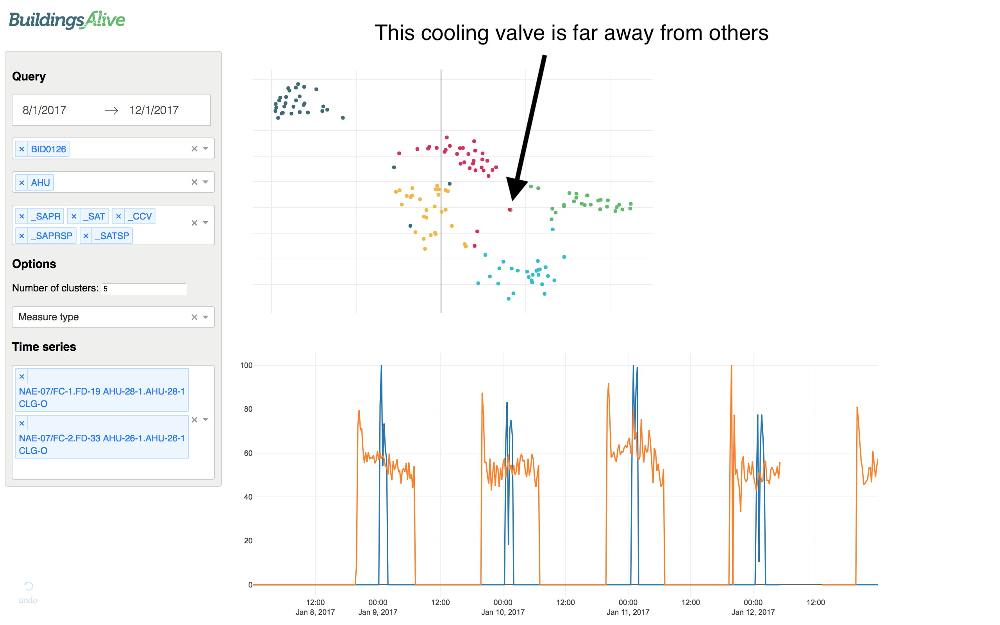

```{r setup, include=FALSE}
knitr::opts_chunk$set(
	echo = FALSE,
	message = FALSE,
	warning = FALSE
)
rm(list=ls())

library(tidyverse)
library(lubridate)
library(hms)
require(e1071)
# library(gridExtra)
library(grid)

ba_palette <- c("#3d6b78", "#60bb6b", "#d52f59", "#f5b835", "#2dbbd6",
                "#816b93", "#b84f80", "#f08c3e", "#c1b97d", "#7e450a",
                "#d4d700", "#00978f")
ba_palette_ramp <- colorRampPalette(ba_palette)
theme_set(theme_bw() +
            theme(strip.background = element_blank()))
ggplot <- function(...) {
  ggplot2::ggplot(...) + 
    scale_colour_manual(values = ba_palette) +
    scale_fill_manual(values = ba_palette)
}

# data_dir <- "/home/croach/Documents/data/bms"
data_dir <- "/Users/cameronroach/Google Drive/data/bms"

# Raw sensor time series data
ts_df <- read_csv(file.path(data_dir, "sensor_ts_presentation/sensor_ts_presentation.csv")) %>% 
  mutate(DT = as.POSIXct(time, origin="1970-01-01"),
         Date = lubridate::date(DT),
         Time = hms::hms(second(DT), minute(DT), hour(DT))) %>% 
  select(-time) %>% 
  rename(Value = value)

# Clustering and dimension reduction data from python
dr_df = NULL
cl_df = NULL
for (iD in list.files(file.path(data_dir, "aceee-paper-data"))) {
  dr_df <- read_csv(file.path(data_dir, "aceee-paper-data", iD, "dr.csv")) %>% 
    mutate(Dataset = iD,
           DR_ALG = case_when(DR_ALG=='SPCA' ~ 'Sparse PCA',
                              DR_ALG=='SE_NN' ~ 'Spectral Embedding (NN)',
                              DR_ALG=='SE_RBF' ~ 'Spectral Embedding (RBF)',
                              TRUE ~ DR_ALG),
           DR_ALG = factor(DR_ALG, levels=c('PCA', 'Sparse PCA', 'ISOMAP', 't-SNE',
                                            'Spectral Embedding (NN)',
                                            'Spectral Embedding (RBF)'))) %>% 
    bind_rows(dr_df)
  
  cl_df <- read_csv(file.path(data_dir, "aceee-paper-data", iD, 'cl.csv')) %>%
    mutate(Dataset = iD,
           CL_ALG = case_when(CL_ALG=='KM' ~ 'k-means',
                              CL_ALG=='AGL' ~ 'Agglomerative',
                              CL_ALG=='AP' ~ 'Affinity Propagation',
                              TRUE ~ CL_ALG),
           CL_ALG = factor(CL_ALG, levels=c('k-means', 'Agglomerative',
                                            'Affinity Propagation', 'DBSCAN'))) %>%
  bind_rows(cl_df)
}
```

## Overview

1. Motivation
2. Feature engineering
3. Unsupervised learning techniques
4. Results
5. Concluding remarks


## Motivation

* Vendor sets up a BMS. The BMS will behave in a certain way based predefined rules.
* BMS systems are costly to implement and to modify. Can require a lot of coding to change the BMS's behaviour.
* The bigger the BMS is the harder it is to find what matters. Locating problems is difficult and time-consuming.
* For example, a heating valve might be locked open. If this isn't detected the BMS will cool the room to reach the required temperature.
* Help facility managers identify if a BMS is operating optimally.
* Want to be able to compare and learn from multiple buildings.

## Motivation

Need an easy way to visualise and explore data.


## Data

Focus on AHU data from three separate buildings.

```{r meter-counts}
bms_df <- read_csv(file.path(data_dir, 'bms_data/bms_data_tidy.csv'))

measure_lkp <- tribble(
  ~MEASURE_TYPE, ~Measure,
  "CCV", "Cooling control valve (CCV)",
  "ECD", "Economy cycle dampers (ECD)",
  "ENB", "Enabled (ENB)",
  "RAT", "Return air temperature (RAT)",
  "SAPR", "Supply air pressure (SAPR)",
  "SAPRSP", "Supply air pressure setpoint (SAPRSP)",
  "SAT", "Supply air temperature (SAT)",
  "SATSP", "Supply air temperature setpoint (SATSP)",
  "SPD", "Speed (SPD)",
  "STS", "Status (STS)",
  "VAVDM", "VAV damper position max (VAVDM)"
)

bms_df %>% 
  mutate(MEASURE_TYPE = substring(MEASURE_TYPE, 2)) %>% 
  filter(METER_TYPE == 'AHU',
         MEASURE_TYPE %in% unique(cl_df$MEASURE_TYPE)) %>% 
  distinct(BUILDINGID, MEASURE_TYPE, UNIQUEID) %>% 
  count(BUILDINGID, MEASURE_TYPE) %>% 
  spread(BUILDINGID, n, fill = 0) %>% 
  inner_join(measure_lkp) %>% 
  select(Measure, starts_with("BID")) %>% 
  knitr::kable(caption = "Number of points for each measurement type.")
```


## Feature engineering

### Metadata features

* Buildings have inconsistent point descriptions. However there are often some useful acronyms hidden within the names.
* Character-level bigrams and trigrams are created for each BMS point's name. Whitespace and numeric values are omitted.
* For example, the first four bigrams of "NAE-08/FC-1.FD-88 AHU-14-1.AHU-14-1 VAV DMPR-POS" will be na, ae, ef and fc. The first four trigrams are nae, aef, efc and fcf.

## Feature engineering

### Time series features

Time series sampled at irregular intervals. Instead of interpolating raw time series (which might corrupt signal) we engineer global features that describe entire time series. These time series features include:

* Number of unique values
* Mean
* Maximum value
* Minimum value
* Standard deviation
* Skew
* Kurtosis
* Maximum change
* Minimum change
* Number of mean crossings.


## Feature engineering

```{r}
sensor_sample_features <- unique(ts_df$Sensor)[c(2,33,250)]
sensor_sample_features <- c("analog-input:3:VAV-L1-PE2-RmTemp:present-value",
                            "analog-value:6:VAV-L2-PN2-SupAirDmpr:present-value",
                            "analog-value:97:CH-R-2-kWr:present-value")

p1 <- ts_df %>%
  filter(Sensor %in% sensor_sample_features) %>% 
  ggplot(aes(x = DT, y = Value, colour = Sensor)) +
  geom_line() + 
  facet_wrap(~Sensor, ncol = 1, scales = "free_y") +
  labs(title = "Raw data",
       x = "Date") +
  theme(legend.position = "none")

p2 <- ts_df %>%
  filter(Sensor %in% sensor_sample_features) %>% 
  group_by(Sensor) %>% 
  arrange(DT) %>% 
  mutate(above_mean = Value >= mean(Value, na.rm = TRUE),
         mean_crossing = (above_mean & !lag(above_mean)) | 
           (!above_mean & lag(above_mean))) %>% 
  summarise(Mean = mean(Value, na.rm = TRUE),
            `Standard deviation` = sd(Value, na.rm = TRUE),
            Kurtosis = kurtosis(Value, na.rm = TRUE),
            Skewness = skewness(Value, na.rm = TRUE),
            `Max change` = abs(max(Value - lag(Value), na.rm = TRUE)),
            `Min change` = abs(min(Value - lag(Value), na.rm = TRUE)),
            `Mean crossings` = sum(mean_crossing, na.rm = TRUE)) %>%
  mutate(Kurtosis = if_else(is.na(Kurtosis), 0, Kurtosis),
         Skewness = if_else(is.na(Skewness), 0, Skewness)) %>% 
  gather(Var, Value, -Sensor) %>% 
  group_by(Var) %>% 
  # mutate(Value = (Value - median(Value))/IQR(Value)) %>%  # scale
  ungroup() %>% 
  ggplot(aes(x=Var, y=Value, colour = Sensor)) +
  geom_col(width = 0) + 
  geom_point() +
  facet_wrap(~Sensor, ncol = 1) +
  labs(title = "Features",
       x = NULL) +
  theme(legend.position = "none") +
  coord_flip()

# grid.arrange(p1, p2, nrow = 1)
grid.newpage()
grid.draw(cbind(ggplotGrob(p1), ggplotGrob(p2), size = "last"))
```


## Unsupervised learning techniques

Approach the problem using dimensionality reduction and clustering.

Several dimensionality reduction algorithms tested:

* principal component analysis
* sparse principal component analysis
* isometric mapping
* t-distributed stochastic neighbour embedding
* spectral embedding (nearest neighbours affinity matrix)
* spectral embedding (radial basis function affinity matrix).


## Principal component analysis

* PCA is an unsupervised learning technique that has been used in various fault detection approaches.
* Despite its popularity it does have some drawbacks that need to be considered.
* PCA focuses on producing orthogonal components that capture as much variation in the data as possible.
* It does not focus on preserving proximity relationships between points and neighbourhoods.


## t-distributed stochastic neighbour embedding

* t-SNE designed for visualising high-dimensional data in a low-dimensional space while preserving nearest neighbours. The algorithm maps each data point to a location in a two or three dimensional space.
* Well suited to visualising high dimensional spaces in two or three dimensions as it plots similar objects nearby and dissimilar objects far away with high probability.
* For certain tasks it has been shown to perform better than other dimension reduction approaches such as Isomap and Locally Linear Embedding.

Drawbacks

* Computationally expensive, $T(n) = \mathcal{O}(n^2)$. In high dimensional settings may require a preliminary dimension reduction step by PCA.
* Can overfit - but that's ok if we're visualising.


## Dimensionality reduction

```{r plot-dr-no-colour}
scale <- function(x) {
  (x-min(x))/max(x-min(x))
}

dr_df %>% 
  filter(Dataset == 'ts_ngram_similar') %>% 
  group_by(DR_ALG) %>% 
  mutate(x1 = scale(x1),
         x2 = scale(x2)) %>% 
  ggplot(aes(x=x1, y=x2)) +
  #geom_jitter(width=0.02, height=0.02) +
  geom_point() +
  facet_wrap(~DR_ALG, nrow=2) +
  labs(x='Component 1', y='Component 2', colour = "Measure Type") +
  theme(aspect.ratio = 1)
```

## Dimensionality reduction

```{r plot-dr}
scale <- function(x) {
  (x-min(x))/max(x-min(x))
}

dr_df %>% 
  filter(Dataset == 'ts_ngram_similar') %>% 
  group_by(DR_ALG) %>% 
  mutate(x1 = scale(x1),
         x2 = scale(x2)) %>% 
  ggplot(aes(x=x1, y=x2, colour=MEASURE_TYPE)) +
  # geom_jitter(width=0.02, height=0.02) +
  geom_point() +
  facet_wrap(~DR_ALG, nrow=2) +
  labs(x='Component 1', y='Component 2', colour = "Measure Type") +
  theme(aspect.ratio = 1)
```

## Dimensionality reduction

```{r}
p1 <- dr_df %>%
  filter(DR_ALG == 't-SNE',
         Dataset %in% c('ts_all', 'ts_ngram_all')) %>%
  mutate(Dataset = if_else(Dataset=='ts_all', 'Time series features', Dataset),
         Dataset = if_else(Dataset=='ts_ngram_all', 'Time series and n-gram features', Dataset),
         Dataset = fct_rev(Dataset)) %>% 
  ggplot(aes(x=x1, y=x2, colour=MEASURE_TYPE)) +
  geom_point() +
  facet_wrap(~Dataset) +
  labs(x='Component 1', y='Component 2', colour = "Measure Type") +
  theme(aspect.ratio = 1)

p2 <- dr_df %>% 
  filter(DR_ALG == 't-SNE',
         Dataset %in% c('ts_all', 'ts_ngram_all')) %>% 
  mutate(Dataset = if_else(Dataset=='ts_all', 'Time series features', Dataset),
         Dataset = if_else(Dataset=='ts_ngram_all', 'Time series and n-gram features', Dataset),
         Dataset = fct_rev(Dataset)) %>% 
  ggplot(aes(x=x1, y=x2, colour=BUILDINGID)) +
  geom_point() +
  facet_wrap(~Dataset) +
  labs(x='Component 1', y='Component 2', colour='Building ID') +
  theme(aspect.ratio = 1)
```

  

\begincols
  \begincol{.54\textwidth}

```{r plot-ts-ngram-all-2}
grid.newpage()
grid.draw(rbind(ggplotGrob(p1), ggplotGrob(p2), size = "last"))
```


  \endcol
\begincol{.44\textwidth}

* Different naming conventions between buildings can cause issues during dimensionality reduction.
* The different clusters that are formed when metadata features are included separate buildings rather than sensor types.
* Possible that using time series features only may be better.

  \endcol
\endcols


## Clustering

Clustering was performed on lower dimensional space produced by t-SNE. Again, several methods were tested:

* k-means
* agglomerative clustering
* affinity propagation
* DBSCAN.

## Clustering

\begincols
\begincol{.54\textwidth}

```{r plot-clusters}
cl_df %>%
  filter(Dataset == 'ts_ngram_similar') %>%
  ggplot(aes(x=x1, y=x2, colour=factor(CLUSTER))) +
  geom_point() +
  facet_wrap(~CL_ALG) +
  labs(x='Component 1', y='Component 2', colour="Cluster") +
  theme(aspect.ratio = 1,
        legend.position='none')
```


\endcol
\begincol{.44\textwidth}

* Each clustering algorithm appears to offer similar performance.
* Possibly because t-SNE produces clear separation between clusters.
* Clustering on t-SNE is risky and so visualisation and exploration is preferred.

\endcol
\endcols


## Examples


## Examples




## Conclusions

* Several dimensionality reduction algorithms are tested with t-SNE appearing to give the most useful two dimensional representation.
* Our low dimensional space allows users to identify anomalous points either manually or automatically via a suitable clustering algorithm.
* Implementation of the proposed methodology was also presented which allows users to rapidly examine many points for different equipment and measurement types.
* Still need to overcome several challenges when incorporating several buildings at once when metadata differs.


## {.standout}

Questions?


## t-SNE overfitting

```{r}
library(Rtsne)

sim_cluster <- function(n, cl, x_mean, y_mean) {
  rerun(n, x = rnorm(1, x_mean), y = rnorm(1, y_mean), Class = cl) %>% 
    bind_rows()
}

sim_cl_df <- sim_cluster(500, "A", -2, 0) %>% 
  bind_rows(sim_cluster(1000, "B", 2, 0))

sim_tsne <- Rtsne(sim_cl_df[, c("x", "y")], dims = 2, perplexity=20)

sim_cl_df <- sim_cl_df %>% 
  mutate(x_tsne = sim_tsne$Y[,1],
         y_tsne = sim_tsne$Y[,2])

sim_cl_df %>%
  rownames_to_column() %>% 
  gather(var, val, -c(rowname, Class)) %>% 
  separate(var, c("X", "Data")) %>% 
  mutate(Data = if_else(is.na(Data), "Raw", "t-SNE")) %>% 
  spread(X, val) %>% 
  select(-rowname) %>% 
  # ggplot(aes(x = x, y = y, colour = Class)) +
  ggplot(aes(x = x, y = y)) + 
  geom_point() +
  facet_wrap(~Data, nrow = 1, scales = "free") +
  theme(legend.position = "bottom")
```

## t-SNE overfitting

```{r}
sim_cl_df %>%
  rownames_to_column() %>% 
  gather(var, val, -c(rowname, Class)) %>% 
  separate(var, c("X", "Data")) %>% 
  mutate(Data = if_else(is.na(Data), "Raw", "t-SNE")) %>% 
  spread(X, val) %>% 
  select(-rowname) %>% 
  ggplot(aes(x = x, y = y, colour = Class)) +
  geom_point() +
  facet_wrap(~Data, nrow = 1, scales = "free") +
  theme(legend.position = "bottom")
```

