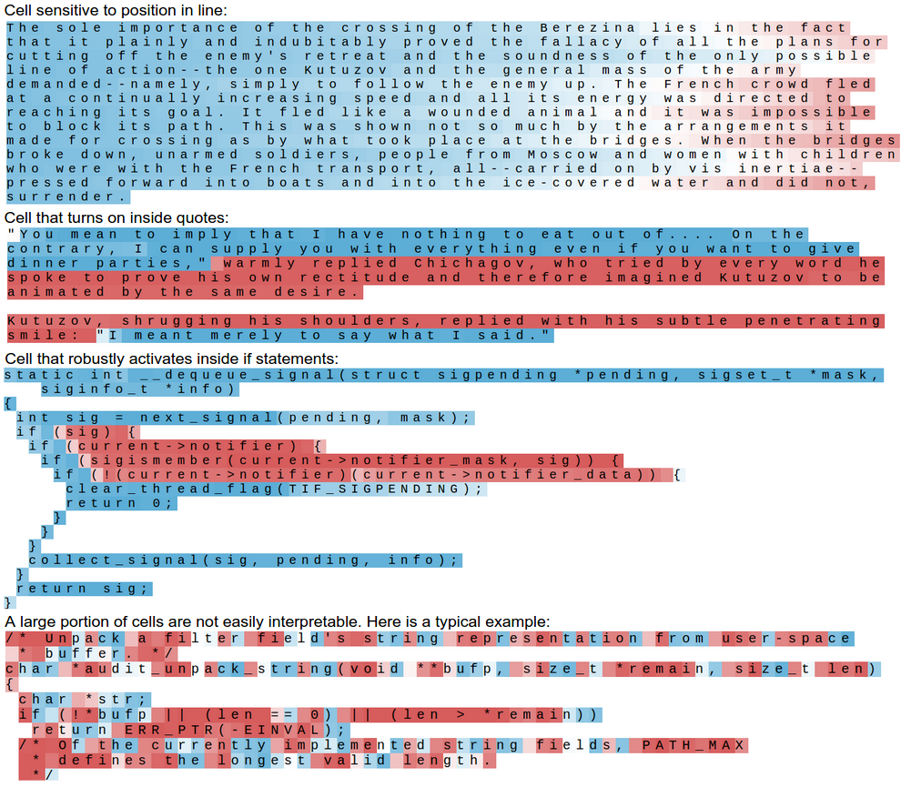
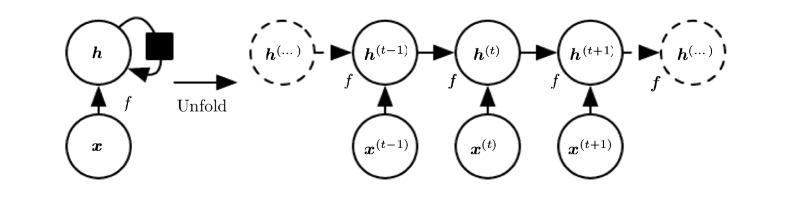
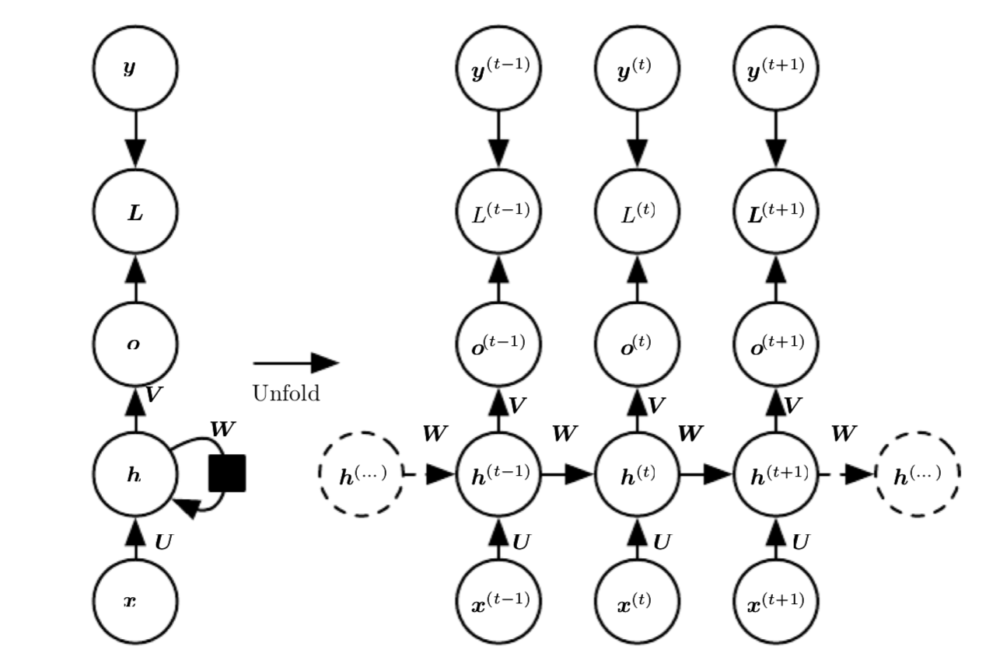

```{r setup, include=FALSE}
knitr::opts_chunk$set(echo = FALSE)
```

## Introduction

Recurrent neural networks (RNNs) are used to process sequential data such as:

* time series
* natural language
* images.

RNNs are used to process a sequence of values $\mathbf{x}^{(1)}, \ldots, \mathbf{x}^{(\tau)}$.

RNNs share parameters across the model. They do not require separate parameters at each time step which allows RNNs to generalize to different forms.

## Examples

### Time series forecasting

A recent kaggle competition forecasting daily hits on Wikipedia pages was won using a sequence to sequence network [@Suilin2017].

### Natural language processing

An RNN trained off Wikipedia articles can learn interesting things about the structure of language.

------




## RNN architecture

### Unfolding computational graphs

The hidden units of a RNN can be expressed in both folded and unfolded forms.



----

We can express this as

$$
\begin{aligned}
  \mathbf{h}^{(t)} &= g^{(t)} \left( \mathbf{x}^{(t)}, \mathbf{x}^{(t-1)}, \ldots, \mathbf{x}^{(1)}\right) \\
    &= f \left( \mathbf{h}^{(t-1)}, \mathbf{x}^{(t)}; \boldsymbol{\theta} \right).
\end{aligned}
$$

Using the unfolded representation allows us to learn a single model $f$ for all time steps.

----

### RNN example



## Training RNNs

RNNs are trained using __back-propagation through time__ (BPTT). BPTT is just standard back-propagation applied to the unfolded graph.

__Teacher forcing__ is an alternative to BPTT and can be used when outputs connect back to the hidden units in the next step and there are no hidden-to-hidden connections. Teacher forcing uses the correct output $\mathbf{y}^{(t-1)}$ as the input to $\mathbf{h}^{(t)}$. This

* decouples the time steps
* allows for parallelisation.

## Types of RNNs

There are many types of RNNs, such as:

* bidirectional
* encoder-decoder sequence-to-sequence architectures
* deep recurrent networks
* recursive neural networks.

## Learning long term dependencies

Learning long term dependencies is difficult due to vanishing or exploding gradients. A simple recurrence relation illustrates why

$$
\begin{aligned}
  \mathbf{h}^{(t)} &= \mathbf{W}' \mathbf{h}^{(t-1)}\\
    &= \left( \mathbf{W}^t \right)' \mathbf{h}^{(0)} \\
    &= \left[ \left( \mathbf{Q} \boldsymbol{\Lambda} \mathbf{Q}' \right)^t \right]' \mathbf{h}^{(0)} \\
    &= \mathbf{Q}' \boldsymbol{\Lambda}^t \mathbf{Q}  \mathbf{h}^{(0)}.
\end{aligned}
$$

where $\mathbf{W}$ allows an eigendecomposition of the form used above and $\mathbf{Q}$ is orthogonal. 

Eigenvalues with magnitude less than one will disappear and those with magnitude greater than one will explode.

---

Long term dependencies can be handled with:

* Echo state networks
* Leaky units.

In practice the best results are achieved with gated RNNs [@Goodfellow2016-ma] such as:

* Long short-term memory (LSTM) network
* Gated recurrent units (GRU).

---

### LSTM


----


## Optimisation for long term dependencies

RNNs suffer from exploding and vanishing gradients.

Exploding gradients can be handled with _gradient clipping_.

We can prevent vanishing gradients by constraining parameters to ensure the gradient vector $\nabla_{\mathbf{h}^{(t)}} L$ being back-propagated maintains its magnitude. However, in practice LSTMs are more effective.

<!-- ## Discussion points -->

<!-- * Many different architectures could be created for RNNs. How doe we know we've selected the correct architecture. Do variations on LSTMs/GRUs offer any benefits? -->
<!-- *  -->


## References {-}
