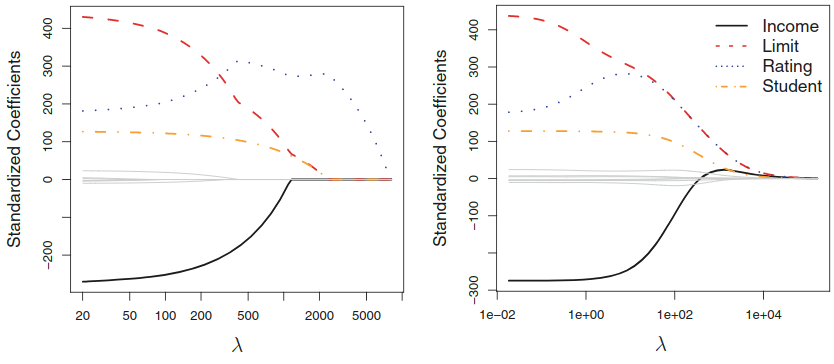
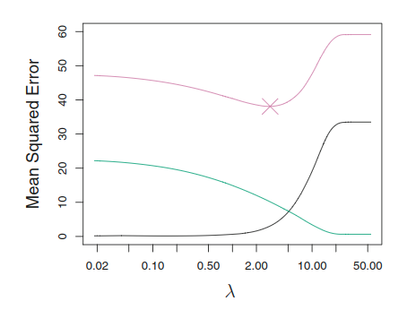
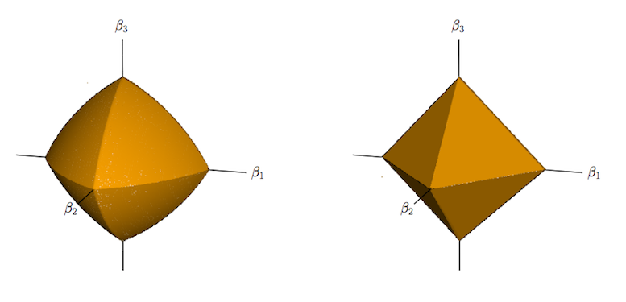
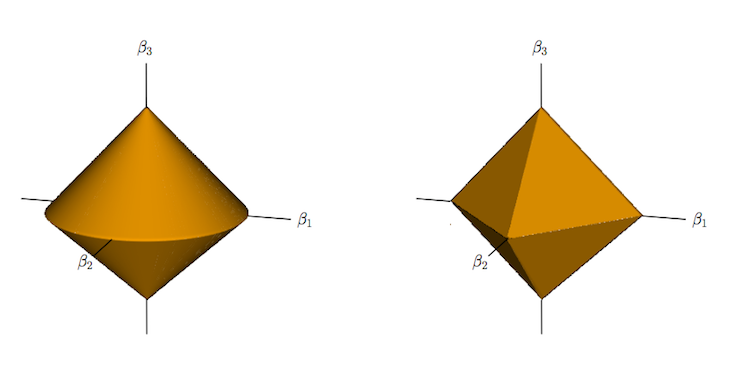
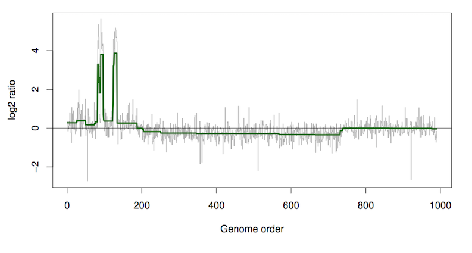

```{r setup, include=FALSE}
knitr::opts_chunk$set(echo = TRUE)
```

## Introduction

* Introduced by @Tibshirani1996-fg (21,216 citations!).
* Allows for automatic variable selection.
* Optimisation problem is convex and can be solved efficiently.


## Motivation

We are given $N$ samples $\left\{ (\mathbf{x}_i, y_i) \right\}_{i=1}^N$ where $\mathbf{x}_i = (x_{i1}, x_{i2}, \ldots, x_{ip})$ and all $x_{ij}, y_i \in \mathbb{R}$. We wish to approximate the response $y_i$. This can be done using a standard OLS approach, but there are drawbacks:

* _Prediction accuracy_: low bias but large variance. Bias-variance trade off can improve prediction accuracy.
* _Interpretation_: difficult if $p$ is large.


## Ridge regression

Ridge regression predates the lasso. Combines the the least-squares loss with an $\ell_2$ penalty. It finds the solution to

$$
\min_{\beta_0, \boldsymbol{\beta}}  \left\{ 
  \frac{1}{2N} \sum^N_{i=1} \left(y_i -\beta_0 - \sum^p_{j=1} \beta_j x_{ij} \right)^2 +
  \lambda \sum^p_{j=1} \left| \beta_j \right|
\right\},
$$

where $\lambda \geq 0$ is the regularization weight.

This can also be expressed in matrix form

$$
\min_{\boldsymbol{\beta}}  \left\{ 
  \frac{1}{2N} \| \mathbf{y} - \mathbf{X}\boldsymbol{\beta} \|^2_2 + \lambda \| \boldsymbol{\beta} \|_2
\right\}.
$$

__TODO: Comment on $\beta_0$.__

Differentiating with respect to $\boldsymbol{\beta}$ and setting equal to zero yields the solution

$$
\hat{\boldsymbol{\beta}} = (\mathbf{X}'\mathbf{X} + \lambda \mathbf{I})^{-1} \mathbf{X}'\mathbf{y}.
$$


## The lasso

The lasso is similar to ridge regression, but uses an $\ell_1$ penalty instead of $\ell_2$. It finds the solution to

$$
\min_{\beta_0, \boldsymbol{\beta}}  \left\{ 
  \frac{1}{2N} \sum^N_{i=1} \left(y_i -\beta_0 - \sum^p_{j=1} \beta_j x_{ij} \right)^2 +
  \lambda \sum^p_{j=1} \left| \beta_j \right|
\right\},
$$

where $\lambda \geq 0$ is the regularization weight.

This can also be expressed in matrix form

$$
\min_{\boldsymbol{\beta}}  \left\{ 
  \frac{1}{2N} \| \mathbf{y} - \mathbf{X}\boldsymbol{\beta} \|^2_2 + \lambda \| \boldsymbol{\beta} \|_1
\right\}.
$$

__TODO: Comment on $\beta_0$.__

Lasso is a quadratic programming problem.

The factor $\frac{1}{2N}$ can be omitted, but does make $\lambda$ comparable for different sample sizes [@Hastie2015-gy].

----

Necessary and sufficient condition for solution takes the form

$$
-\frac{1}{N}\left< \mathbf{x}_j, \mathbf{y} - \mathbf{X} \boldsymbol{\beta}\right> + \lambda s_j = 0, \quad j=1,\ldots,p,
$$

where $s_j$

## Properties

The estimates of $\boldsymbol{\beta}$ given by ridge regression and the lasso have different properties despite their similarity.

* Ridge regression pushes coefficients towards zero, whereas lasso can make certain coefficients exactly equal to zero.
* Lasso handles sparsity well (only a few non-zero columns).
* Lasso does not handle highly correlated predictors well.

----

### Parameter estimation

<div class="centered">

</div>

----

### Coefficient paths

<div class="centered">

</div>

----

### Bias-variance tradeoff

<div class="centered">

</div>

## Computation

The lasso is a quadratic programming problem.

## Generalisations

### Elastic net

The lasso does not handle highly correlated variables well.

* Coefficient paths can be erratic.
* If data is augmented with an identical copy of a feature then coefficients for this feature will not be defined using lasso.
* A quadratic penalty will divide the coefficient equally across these two identical features.

Can combine the ridge and lasso penalties to obtain the _elastic net_, which solves

$$
\min_{\beta_0, \boldsymbol{\beta}}  \left\{ 
  \frac{1}{2} \sum^N_{i=1} \left(y_i -\beta_0 - \boldsymbol{\beta} x_i \right)^2 +
  \lambda \left( \frac{1}{2}(1-\alpha) \left\| \boldsymbol{\beta} \right\|_2^2 +\alpha \left\| \boldsymbol{\beta} \right\|_1 \right)
\right\},
$$

where $\alpha \in [0,1]$ is a parameter that varies the $\ell_1$ or $\ell_2$ penalty and $\lambda \geq 0$ is again a regularization weight. For $\alpha \neq 1$ the elastic net is strictly convex - a unique solution exists.

Again, covariates can be centered to remove the intercept $\beta_0$ which may then be calculated by $\hat{\beta}_0 = \bar{y}$.

----

<div class="centered">

</div>

----

### Group lasso

----

<div class="centered">

</div>

----

### Fused lasso

<div class="centered">

</div>

## Fun with R!

A quick example using `R`'s `caret` and `glmnet` packages.


## References and further reading {-}
