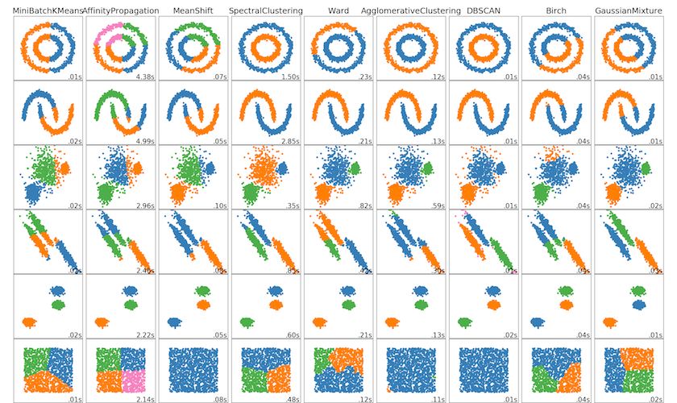
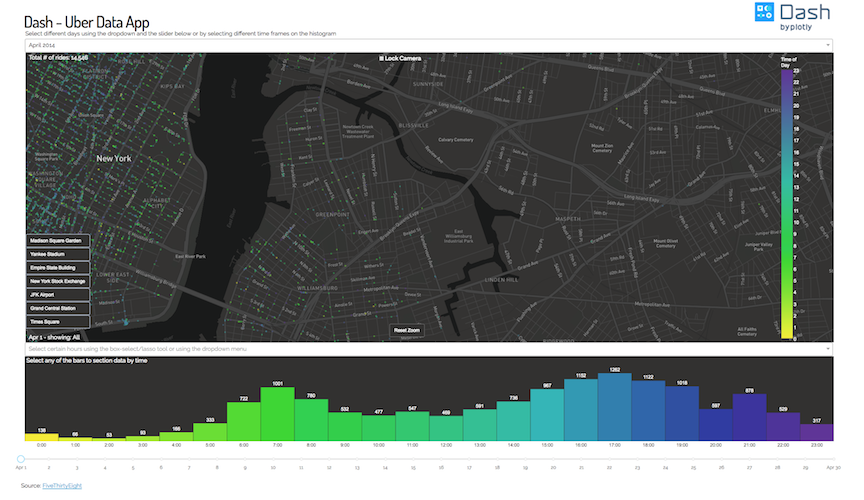

```{r setup, include=FALSE}
knitr::opts_chunk$set(
	echo = FALSE,
	message = FALSE,
	warning = FALSE
)

rm(list=ls())

require(readr)
require(dplyr)
require(tidyr)
require(ggplot2)
require(lubridate)
require(hms)
require(e1071)

set.seed(1234)

ba_palette = c("#3d6b78", "#60bb6b", "#d52f59", "#f5b835", "#2dbbd6",
               "#816b93", "#b84f80", "#f08c3e", "#c1b97d", "#7e450a",
               "#d4d700", "#00978f")

data <- read_csv("data/data.csv") %>% 
  mutate(DT = as.POSIXct(time, origin="1970-01-01"),
         Date = floor_date(DT, "day"),
         Time = hms(second(DT), minute(DT), hour(DT))) %>% 
  rename(Value = value) %>% 
  select(-time)

sensor_sample <- sample(unique(data$Sensor), 10)
```

## Overview

* Smart buildings
* Analysing the data
* Building an end product

# Smart buildings | Trying to be smart with commercial building data

## How do commercial buildings work?

* Facility managers oversee the day to day operations of a commercial building.
* Building operations are automated by Building Management Systems (BMSs).

## What is a BMS?

* Commercial buildings contain Building Management Systems (BMSs).
* Control heating, cooling, ventilation and lighting systems.
* Typically contain a lot of sensors (>100,000).

## How does this work in practice?

Vendor comes in, sets up a BMS. The BMS will behave in a certain way based predefined rules.

Simple example - if high temperature readings are recorded in a room, more cooling will happen.

BMS systems are costly to implement and to change. Can often require large amounts of recoding just to change a temperature set point.

## So what can we do?

* Help facility managers identify when a building is behaving erratically (automated fault detection).
* Wealth of literature on fault detection
    + Statistical methods
    + Qualitative methods
    + Quantitative
* Buildings Alive's goal is to build an automated fault detection method to suit the data that we've collected and which can scale to multiple buildings.
* Collect data using our E2 device and analyse!

# Analysing the data | Feature extraction, dimensionality reduction, clustering

----

```{r plot-bms-raw}
data %>%
  filter(Sensor %in% sensor_sample) %>% 
  ggplot(aes(x=DT, y=Value, colour = Sensor)) +
  geom_line() + 
  facet_wrap(~Sensor, ncol = 2, scales = "free_y") +
  labs(title = "BMS data",
       x = "Date") +
  scale_color_manual(values = ba_palette) + 
  theme(legend.position = "none")
```

----

```{r plot-raw-timing}
data %>%
  filter(Sensor %in% sensor_sample,
         Time >= hms(1,1,0),
         Time < hms(1,1,3)) %>% 
  ggplot() +
  #geom_density(aes(x = Time, fill = Sensor), bw=100, alpha = 0.7, colour=NA) +
  #geom_rug() + 
  geom_vline(aes(xintercept = Time, colour = Sensor)) +
  facet_wrap(~Sensor, scales = "free_y", ncol = 1, strip.position = "right") +
  labs(title = "Sensor reading times",
       x = "Time") +
  scale_colour_manual(values = ba_palette) +
  theme(legend.position = "none",
        strip.text.y = element_text(angle = 0),
        axis.title.y=element_blank(),
        axis.text.y=element_blank(),
        axis.ticks.y=element_blank())
```

## Feature extraction

* Dealing with thousands of unevenly spaced time-series.
* Uneven spacing in time-series presents difficulties
* Rather than rounding or imputing data, extract features and analyse them.

## What features might be useful? {.smaller}

Feature extraction for clustering discussed in @Wang2006-tz. Some useful features for our case might be

* Mean
* Standard deviation
* Kurtosis
* Skewness
* Biggest change ($\max_i \left\{ \left| y_{t_i} - y_{t_{i-1}} \right| \right\}$)
* Smallest change ($\min_i \left\{ \left| y_{t_i} - y_{t_{i-1}} \right| \right\}$)
* Number of "mean crossings" per day

Normalise these features using their median, $M$, and interquartile range, $IQR$,

$$
y^* = \frac{y - M}{IQR}.
$$

----

```{r}
sensor_sample_features <- unique(data$Sensor)[c(2,33,250)]

data %>%
  filter(Sensor %in% sensor_sample_features) %>% 
  ggplot(aes(x=DT, y=Value, colour = Sensor)) +
  geom_line() + 
  facet_wrap(~Sensor, ncol = 1, scales = "free_y") +
  labs(title = "BMS data",
       x = "Date") +
  scale_color_manual(values = ba_palette) + 
  theme(legend.position = "none")
```

----

```{r}
data %>%
  filter(Sensor %in% sensor_sample_features) %>% 
  group_by(Sensor) %>% 
  arrange(DT) %>% 
  mutate(above_mean = Value >= mean(Value, na.rm = TRUE),
         mean_crossing = (above_mean & !lag(above_mean)) | 
           (!above_mean & lag(above_mean))) %>% 
  summarise(Mean = mean(Value, na.rm = TRUE),
            `Standard deviation` = sd(Value, na.rm = TRUE),
            Kurtosis = kurtosis(Value, na.rm = TRUE),
            Skewness = skewness(Value, na.rm = TRUE),
            `Max change` = abs(max(Value - lag(Value), na.rm = TRUE)),
            `Min change` = abs(min(Value - lag(Value), na.rm = TRUE)),
            `Mean crossings` = sum(mean_crossing, na.rm = TRUE)) %>%
  mutate(Kurtosis = if_else(is.na(Kurtosis), 0, Kurtosis),
         Skewness = if_else(is.na(Skewness), 0, Skewness)) %>% 
  gather(Var, Value, -Sensor) %>% 
  group_by(Var) %>% 
  mutate(Value = (Value - median(Value))/IQR(Value)) %>% 
  ungroup() %>% 
  ggplot(aes(x=Var, y=Value, colour = Sensor)) +
  geom_col(width = 0) + 
  geom_point() +
  facet_wrap(~Sensor, ncol = 1) +
  labs(title = "BMS data",
       x = "Features") +
  scale_color_manual(values = ba_palette) + 
  theme(legend.position = "none") +
  coord_flip()
```

## Dimension reduction and clustering

* Too many sensors to visualise easily.
* Use dimensionality reduction.
* Look for clusters.

----

### Which clustering algorithm?

Method | Advantages | Disadvantages 
-------|------------|----------------
K-means | Easy to learn | Outperformed by other algorithms
K-medoids | Better performance than K-means | Can suffer from local minima
Dirichlet process | | 
Affinity propagation | Automatically determines number of clusters | 
Spectral clustering | Good performance and efficient |
Hierarchical clustering | Produces a dendrogram - no "flat" clustering | 

----

<div class="centered">

</div>

## Obligatory mathematics slide {.smaller}

### Spectral clustering

We are given $n$ points $x_i \in \mathbb{R}^p$ and a similarity matrix $\mathbf{S}$. Define the weight matrix, degree matrix and graph Laplacian as

$$
\begin{split}
\mathbf{W} &= \left(w_{ij}\right) \in \mathbb{R}^{n \times n} \\
\mathbf{D} &= \mathrm{diag} \left( d_i \right) \\
\mathbf{L} &= \mathbf{D} - \mathbf{W},
\end{split}
$$

where,

* $w_{ij}$ is the weight between nodes $i$ and $j$ based on $\mathbf{S}$, and,
* $d_i = \sum_{j=1}^n w_{ij}$ is the weighted degree of node $i$.

Once $\mathbf{L}$ is determined find the $m$ eigenvectors $\mathbf{Z}_{n \times m}$ corresponding to the $m$ smallest eigenvalues of $\mathbf{L}$. Finally, cluster the rows of $\mathbf{Z}_{n \times m}$ using K-means.


# Building an end product | Prototyping with Dash

## Dash

<div class="columns-2">
* Recently released by Plotly.
* Easily build web applications for data analytics.
* Open sourced under the MIT license.
* Works nicely with the existing Plotly graphing libraries.
* Python equivalent of `R`'s Shiny.


</div>

----

<div class="centered">



</div>

## Simple example {.smaller}

```{python dash-simple-app, eval=FALSE, echo=TRUE}
import dash
from dash.dependencies import Input, Output
import dash_core_components as dcc
import dash_html_components as html
import pandas as pd

app = dash.Dash()

app.layout = html.Div([
    dcc.Dropdown(id='my-dropdown',
                 options=[{'label': 'Option A', 'value': 'A'},
                          {'label': 'Option B', 'value': 'B'}]),
    dcc.Graph(id='my-graph')
])

### <b>
@app.callback(Output('my-graph', 'figure'),
              [Input('my-dropdown', 'value')])
def update_graph(dd_value):
    df_query = df.query("Variable == @dd_value")
    return {'data': [{'x': df_query.x, 'y': df_query.y}]}
### </b>
    
if __name__ == '__main__':
    app.run_server()
```

## Demonstration

# Thank-you for listening! | Any questions?

## References {-}
