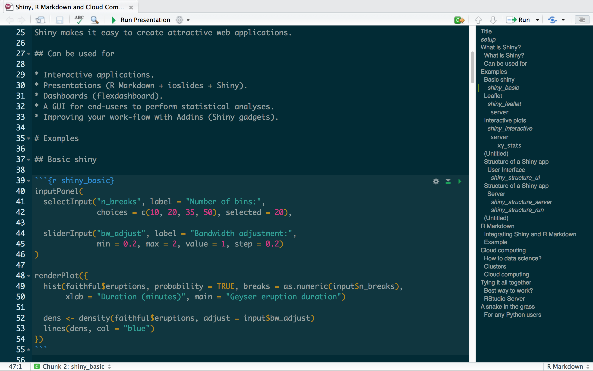
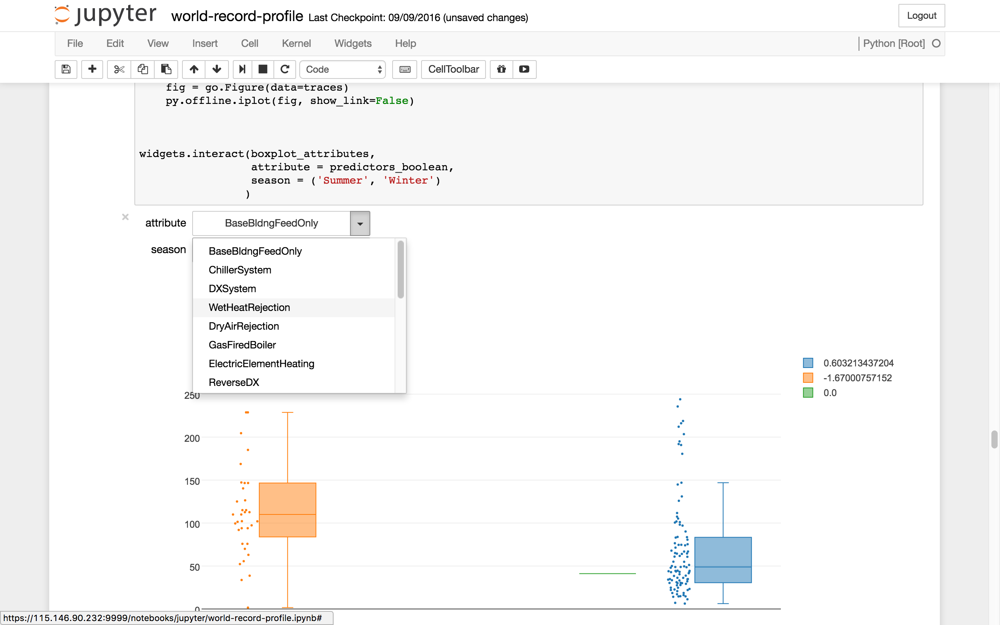

```{r setup, include=FALSE}
knitr::opts_chunk$set(echo = FALSE)

require(leaflet)
require(RColorBrewer)
require(DT)
```

# What is Shiny?

## What is Shiny?

Shiny is a wrapper for various HTML, JavaScript and CSS functions.

Shiny makes it easy to create attractive web applications.

## Can be used for

* Interactive applications.
* Presentations (R Markdown + ioslides + Shiny).
* Dashboards ([flexdashboard](http://rmarkdown.rstudio.com/flexdashboard/)).
* A GUI for end-users to perform statistical analyses.
* Improving your work-flow with Addins ([Shiny gadgets](http://shiny.rstudio.com/articles/gadgets.html)).

# Examples

## Basic shiny

```{r shiny_basic}
inputPanel(
  selectInput("n_breaks", label = "Number of bins:",
              choices = c(10, 20, 35, 50), selected = 20),
  
  sliderInput("bw_adjust", label = "Bandwidth adjustment:",
              min = 0.2, max = 2, value = 1, step = 0.2)
)

renderPlot({
  hist(faithful$eruptions, probability = TRUE, breaks = as.numeric(input$n_breaks),
       xlab = "Duration (minutes)", main = "Geyser eruption duration")
  
  dens <- density(faithful$eruptions, adjust = input$bw_adjust)
  lines(dens, col = "blue")
})
```


## Leaflet

```{r shiny_leaflet}
ui <- bootstrapPage(
  tags$style(type = "text/css",
             "html, body {width:100%;height:100%}"),
  
  leafletOutput("map", width = "100%", height = "100%"),
  
  absolutePanel(top = 10, 
                right = 10,
                draggable = TRUE,
                style = "opacity: 0.92;",
                sliderInput("range", "Magnitudes", min(quakes$mag), max(quakes$mag),
                            value = range(quakes$mag), step = 0.1
                ),
                selectInput("colors", "Color Scheme",
                            rownames(subset(brewer.pal.info, category %in% c("seq", "div")))
                ),
                checkboxInput("legend", "Show legend", TRUE)
  )
)

server <- function(input, output, session) {
  
  # Reactive expression for the data subsetted to what the user selected
  filteredData <- reactive({
    quakes[quakes$mag >= input$range[1] & quakes$mag <= input$range[2],]
  })
  
  # This reactive expression represents the palette function,
  # which changes as the user makes selections in UI.
  colorpal <- reactive({
    colorNumeric(input$colors, quakes$mag)
  })
  
  output$map <- renderLeaflet({
    # Use leaflet() here, and only include aspects of the map that
    # won't need to change dynamically (at least, not unless the
    # entire map is being torn down and recreated).
    leaflet(quakes) %>% addTiles() %>%
      fitBounds(~min(long), ~min(lat), ~max(long), ~max(lat))
  })
  
  # Incremental changes to the map (in this case, replacing the
  # circles when a new color is chosen) should be performed in
  # an observer. Each independent set of things that can change
  # should be managed in its own observer.
  observe({
    pal <- colorpal()
    
    leafletProxy("map", data = filteredData()) %>%
      clearShapes() %>%
      addCircles(radius = ~10^mag/10, weight = 1, color = "#777777",
                 fillColor = ~pal(mag), fillOpacity = 0.7, popup = ~paste(mag)
      )
  })
  
  # Use a separate observer to recreate the legend as needed.
  observe({
    proxy <- leafletProxy("map", data = quakes)
    
    # Remove any existing legend, and only if the legend is
    # enabled, create a new one.
    proxy %>% clearControls()
    if (input$legend) {
      pal <- colorpal()
      proxy %>% addLegend(position = "bottomright",
                          pal = pal, values = ~mag
      )
    }
  })
}

shinyApp(ui, server)
```

## Interactive plots

```{r shiny_interactive}
ui <- fluidPage(tabsetPanel(
  tabPanel("Plot",
           fluidRow(
             column(8, 
                    br(),
                    p("Brush plot to select points to use for statistical analysis."),
                    plotOutput("plot1", brush = "plot_brush")),
             column(4, 
                    br(),
                    verbatimTextOutput("stats"))
           )),
  tabPanel("Data",
           dataTableOutput("info"))
))

server <- function(input, output) {
  output$plot1 <- renderPlot({
    plot(mtcars$wt, mtcars$mpg, xlab="Weight (1000 lbs)", 
         ylab="Miles/(US) gallon", main = "Motor Trend Car Road Tests")
  })

  output$info <- renderDataTable({
    # With base graphics, need to tell it what the x and y variables are.
    brushedPoints(mtcars, input$plot_brush, xvar = "wt", yvar = "mpg")
  })
  
  
  
  output$stats <- renderText({
    xy_stats <- function(x) {
      if(dim(x)[1]==0) return("NULL\n")
      paste0(
        "Advanced statistical calculations\n\n",
        "wt min = ", min(x$wt), "\n",
        "wt max = ", max(x$wt), "\n",
        "mpg min = ", min(x$mpg), "\n",
        "mpg max = ", max(x$mpg))
    }
    
    xy_stats(brushedPoints(mtcars, input$plot_brush, xvar = "wt", yvar = "mpg"))
  })
}

shinyApp(ui, server)
```


## Resources

A great starting point is the official [Shiny Tutorial](http://shiny.rstudio.com/tutorial/).

More examples can be found in the [Shiny Gallery](http://shiny.rstudio.com/gallery/).

Many other learning resources are available!


## Structure of a Shiny app

### User Interface
```{r shiny_structure_ui, echo=TRUE, eval=FALSE}
ui <- shinyUI(fluidPage(
  titlePanel("Plot title"),
  
  sidebarLayout(
    sidebarPanel(
      ### <b>
      sliderInput("bins", "Number of bins:", min = 1, max = 50, 
                  value = 30)
      ### </b>
    ),
    
    mainPanel(
      ### <b>
      plotOutput("distPlot")
      ###</b>
    )
  )
))
```

## Structure of a Shiny app

### Server
```{r shiny_structure_server, echo=TRUE, eval=FALSE}
server <- shinyServer(function(input, output) {
  ### <b>
  output$distPlot <- renderPlot({
    bins <- seq(min(data), max(data), length.out = input$bins + 1)
    ### </b>
    hist(data, breaks = bins)
  })
})
```

To run the application

```{r shiny_structure_run, echo=TRUE, eval=FALSE}
shinyApp(ui = ui, server = server)
```

----

Note that there are quite a few different ways to write a Shiny app.

Don't get confused! It's all the same thing.


# R Markdown

## Integrating Shiny and R Markdown

RStudio makes this very easy. Simply select a new R Markdown document and select shiny.

Works the same as a typical R Markdown document but can now add chunks that contain shiny applications.

One disadvantage is that you can no longer export static html files for distribution. Need to either publish or send raw .Rmd file.

## Example

```{r, out.width = "850px"}

```

# Cloud computing

## How to data science?

Dealing with large quantities of data often requires extra computational power.

High performance computing (HPC) options

* Cloud services (AWS, Nectar)
* Clusters (Monarch)

## Clusters

Monarch is Monash's HPC Cluster and is available to all staff and students.

Advantages

* Lots of different servers available.
* Considerable amount of computing power.

Disadvantages

* Have to schedule jobs using slurm and then wait for them to run.
* If there is an error need to debug and then reschedule the job and wait all over again.

## Cloud computing

Nectar is available to all staff and students at Australian universities. It is very similar to AWS's EC2 service.

Advantages

* Easy to scale.
* Can host RStudio or Shiny server.
* Just wonderful.

Disadvantages

* Need to be careful with security.

# Tying it all together

## Best way to work?

If you're happy writing stand-alone scripts to run on a cluster then Monarch will meet your needs.

However, if you want to create interactive documents with a HPC back-end your best option is Shiny + R Markdown + Nectar.

## RStudio Server

So is it possible to create Shiny + R Markdown documents with a HPC back-end?

Yes - and easily too!

1. Create an Ubuntu instance on Nectar.
2. Download and install RStudio Server.
3. Set up security group rules.
4. Log in from your web browser.
5. (Optional) set up SSL encryption using Nginx/Apache2 server and OpenSSL.

The last step isn't required if using the commercial version of RStudio Server.

# A snake in the grass

## For any Python users

Python can achieve similar results using Jupyter notebooks and the ipywidgets package.

----

```{r, out.width = "900px"}

```


# Questions?

## Thanks for listening ᕙ(◍‿◎)ᕗ